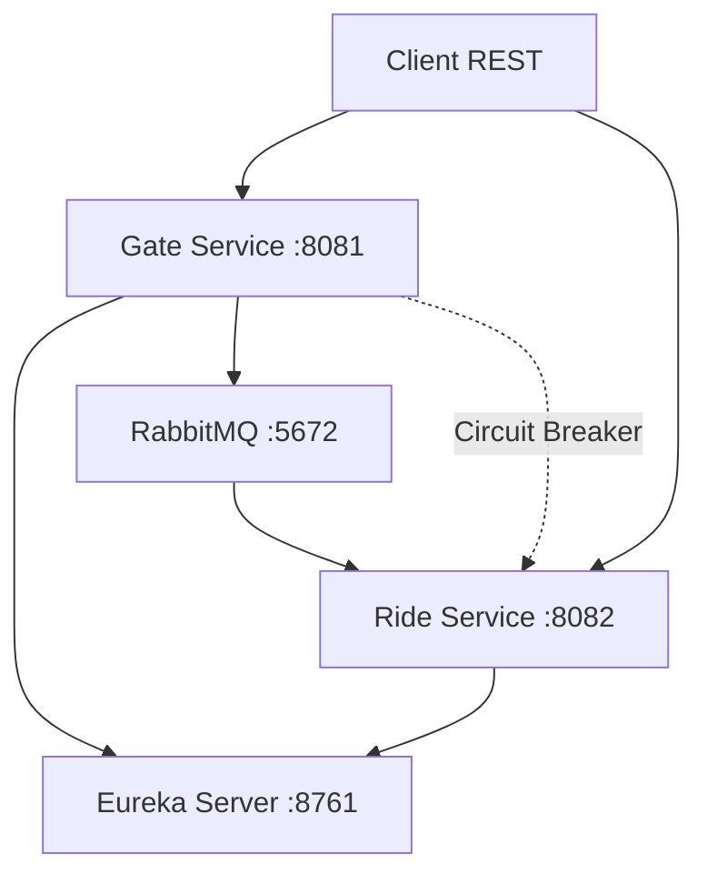
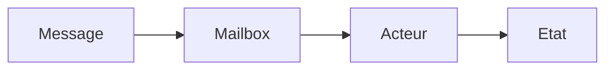
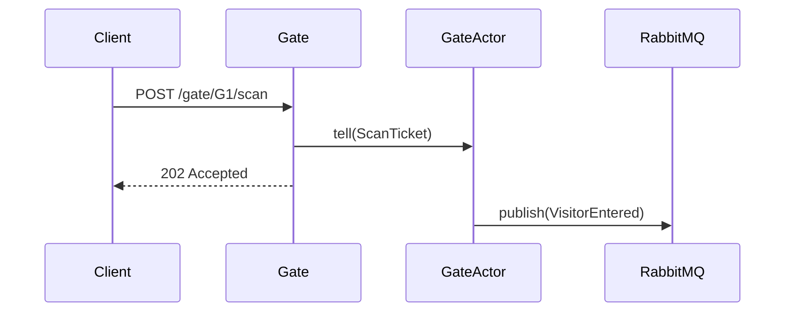
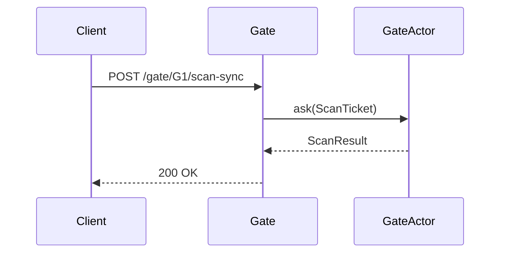
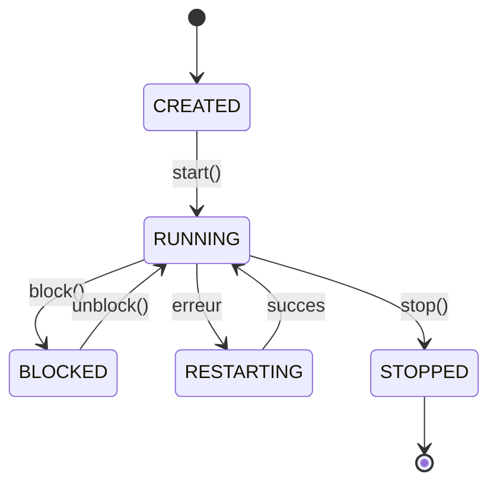
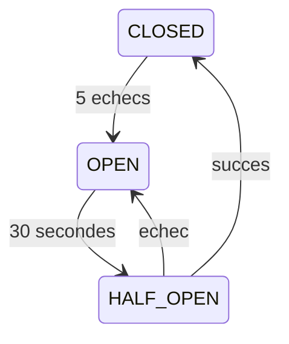
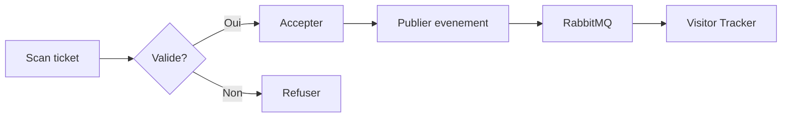

# Architecture - CY Land

Document d'architecture du projet CY Land - Framework d'acteurs distribues.

## 1. Vue d'ensemble

Le systeme comprend :
- **Eureka Server** : Annuaire des services
- **Gate Service** : Gestion des entrees du parc
- **Ride Service** : Gestion des attractions
- **RabbitMQ** : Messagerie entre services

---

## 2. Modele d'acteurs

Principe :
- Chaque acteur a sa propre mailbox
- Traitement d'un message a la fois
- Communication uniquement par messages

---

## 3. Communication entre services

### Pattern Tell (asynchrone)

### Pattern Ask (synchrone)

---

## 4. Cycle de vie des acteurs

---

## 5. Supervision

Quand un acteur echoue, le superviseur decide :

| Directive | Action |
|-----------|--------|
| RESUME | Continuer |
| RESTART | Redemarrer l'acteur |
| STOP | Arreter l'acteur |
| ESCALATE | Remonter au parent |

Deux strategies :
- **OneForOne** : Seul l'acteur en erreur est affecte
- **AllForOne** : Tous les enfants sont affectes

---

## 6. Circuit Breaker (Resilience4j)

Protection des appels entre services :

| Etat | Comportement |
|------|--------------|
| CLOSED | Normal, appels autorises |
| OPEN | Echec immediat, pas d'appel |
| HALF_OPEN | Test de recuperation |

Configuration :
- Ouverture apres 5 echecs
- Attente de 30s avant test
- Retry : 3 tentatives (500ms, 1s, 2s)

---

## 7. Structure des acteurs

### Gate Service

| Acteur | Role |
|--------|------|
| G1, G2 | Portes principales |
| VIP | Porte VIP |
| Scanner Pool | Pool de scanners (2-10) |

### Ride Service

| Acteur | Role |
|--------|------|
| rc | RollerCoaster |
| gr | Grande Roue |
| vr | Simulateur VR |
| visitor-tracker | Suivi visiteurs |

---

## 8. Flux de donnees

---

## 9. Tests

42 tests au total :
- 8 tests framework
- 18 tests Gate Service (dont 10 inter-services)
- 16 tests Ride Service

Tests inter-services :
- Publication d'evenements RabbitMQ
- Resilience quand service indisponible
- Test de charge (50 scans)

---

## 10. Technologies

- Java 21 (Virtual Threads)
- Spring Boot 3.4
- Spring Cloud (Eureka, Stream)
- RabbitMQ
- Resilience4j
- JUnit 5 + Awaitility
