# Diagrammes d'Architecture - CY Land Actor Framework

Ce document contient les diagrammes d'architecture du projet CY Land, un framework d'acteurs distribués inspiré d'Akka.

## Table des matières

1. [Architecture Globale](#1-architecture-globale)
2. [Modèle d'Acteurs](#2-modèle-dacteurs)
3. [Communication Inter-Services](#3-communication-inter-services)
4. [Cycle de Vie des Acteurs](#4-cycle-de-vie-des-acteurs)
5. [Stratégies de Supervision](#5-stratégies-de-supervision)
6. [Auto-Scaling Pool](#6-auto-scaling-pool)
7. [Flux de Données](#7-flux-de-données)
8. [Diagramme de Classes](#8-diagramme-de-classes)
9. [Tolérance aux Pannes avec Resilience4j](#9-tolérance-aux-pannes-avec-resilience4j)
10. [Tests d'Intégration Inter-Services](#10-tests-dintégration-inter-services)

---

## 1. Architecture Globale

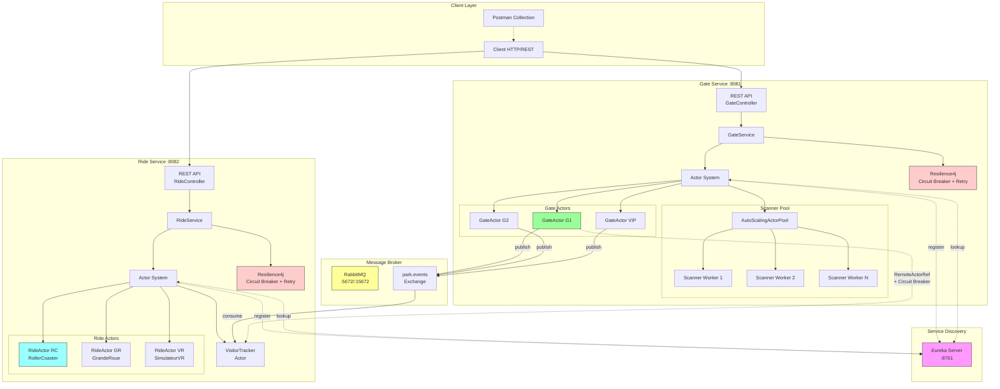

---

## 2. Modèle d'Acteurs

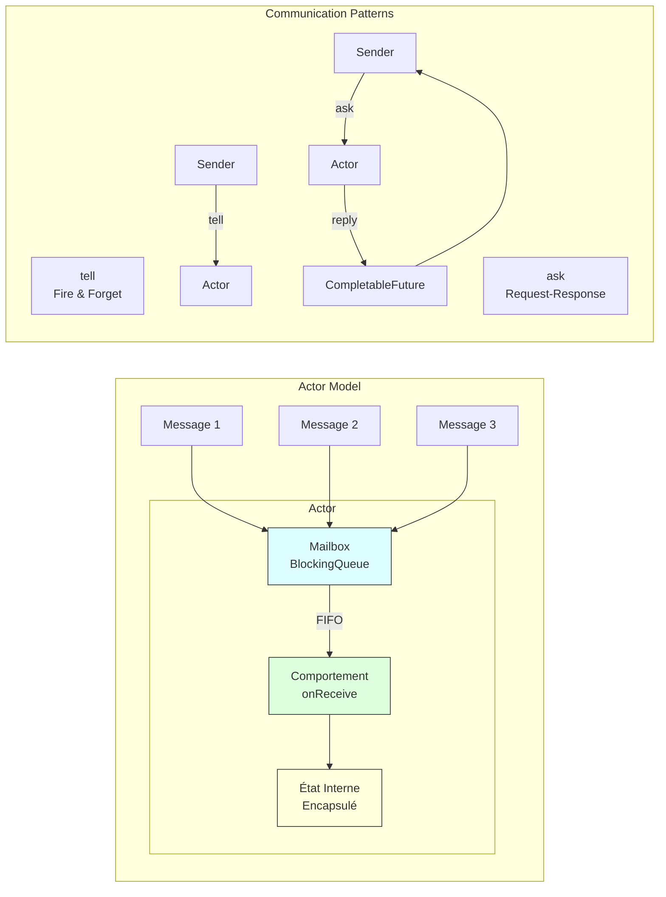

---

## 3. Communication Inter-Services

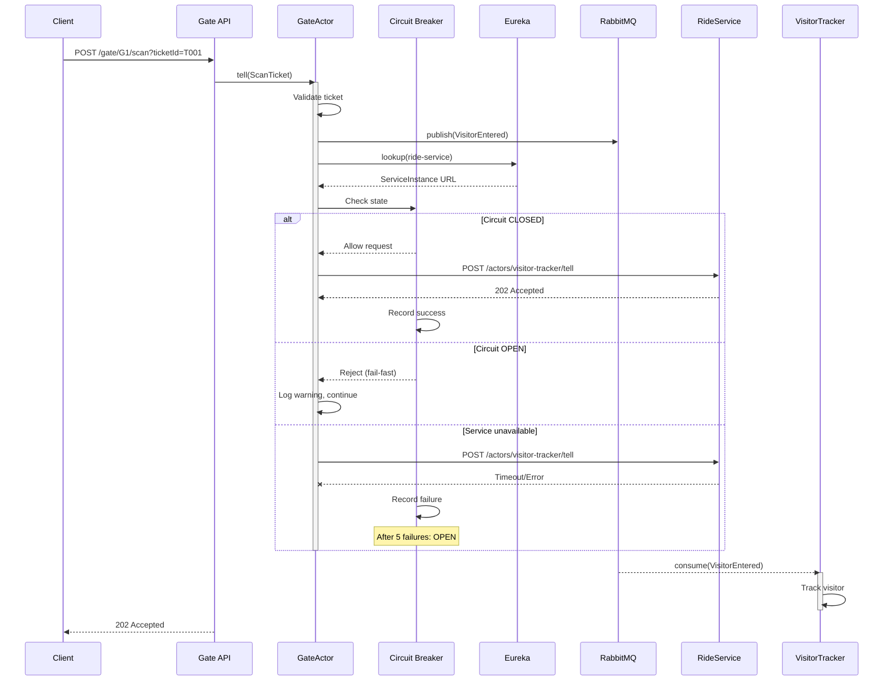

---

## 4. Cycle de Vie des Acteurs

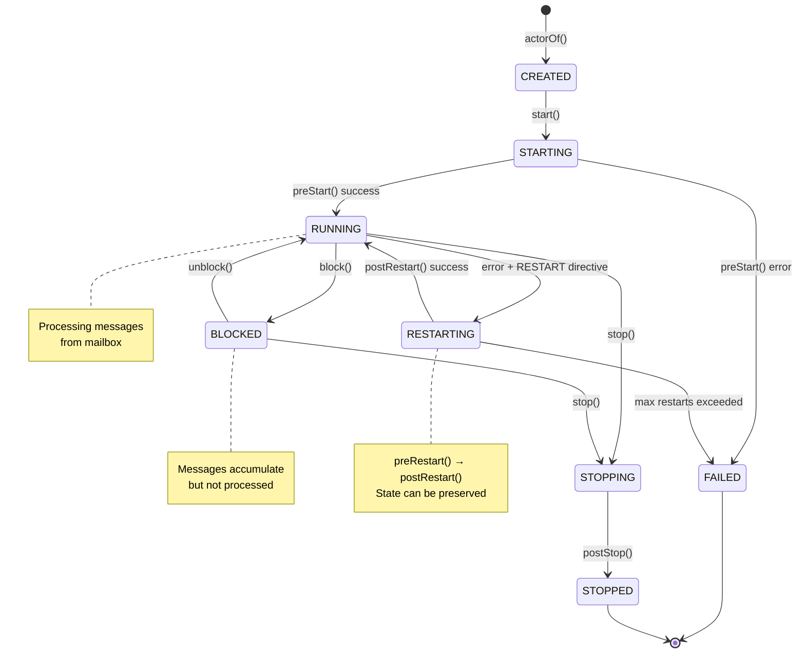

---

## 5. Stratégies de Supervision

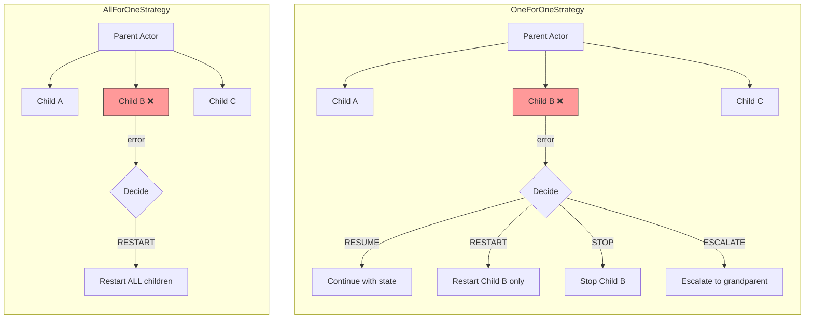

---

## 6. Auto-Scaling Pool

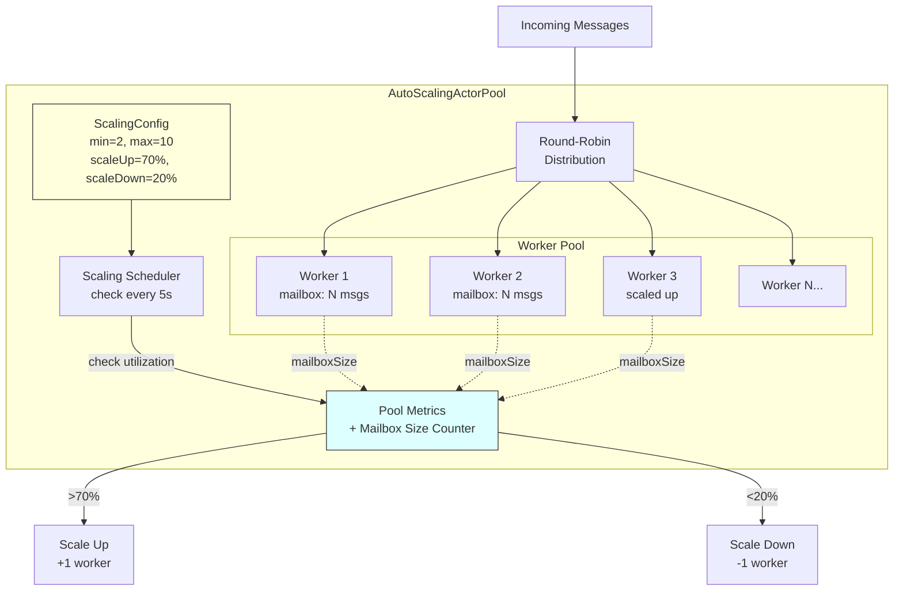

---

## 7. Flux de Données

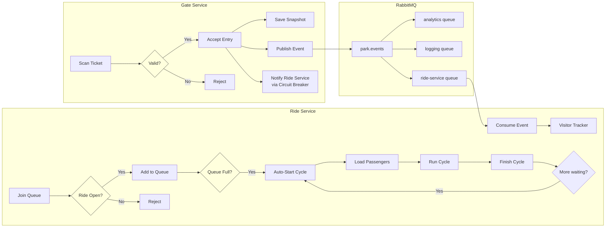

---

## 8. Diagramme de Classes

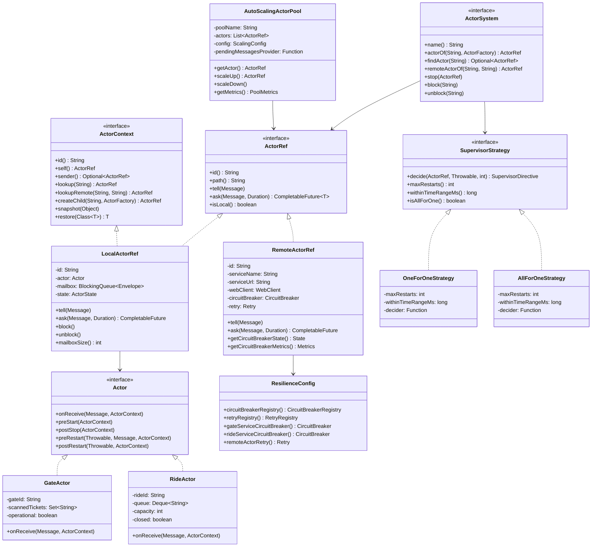

---

## 9. Tolérance aux Pannes avec Resilience4j

### 9.1 Architecture de Résilience

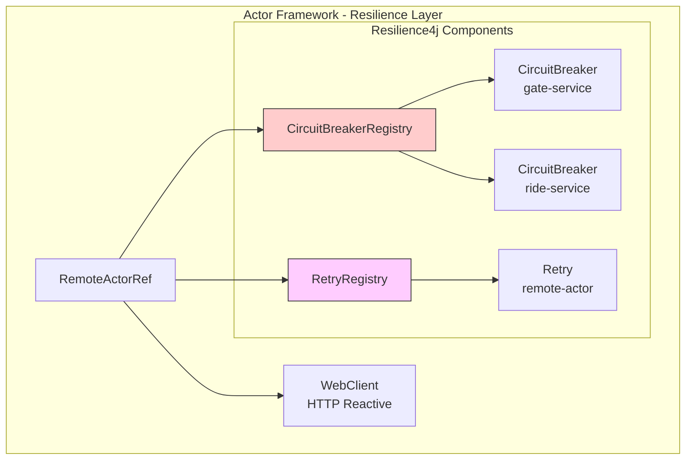

### 9.2 États du Circuit Breaker

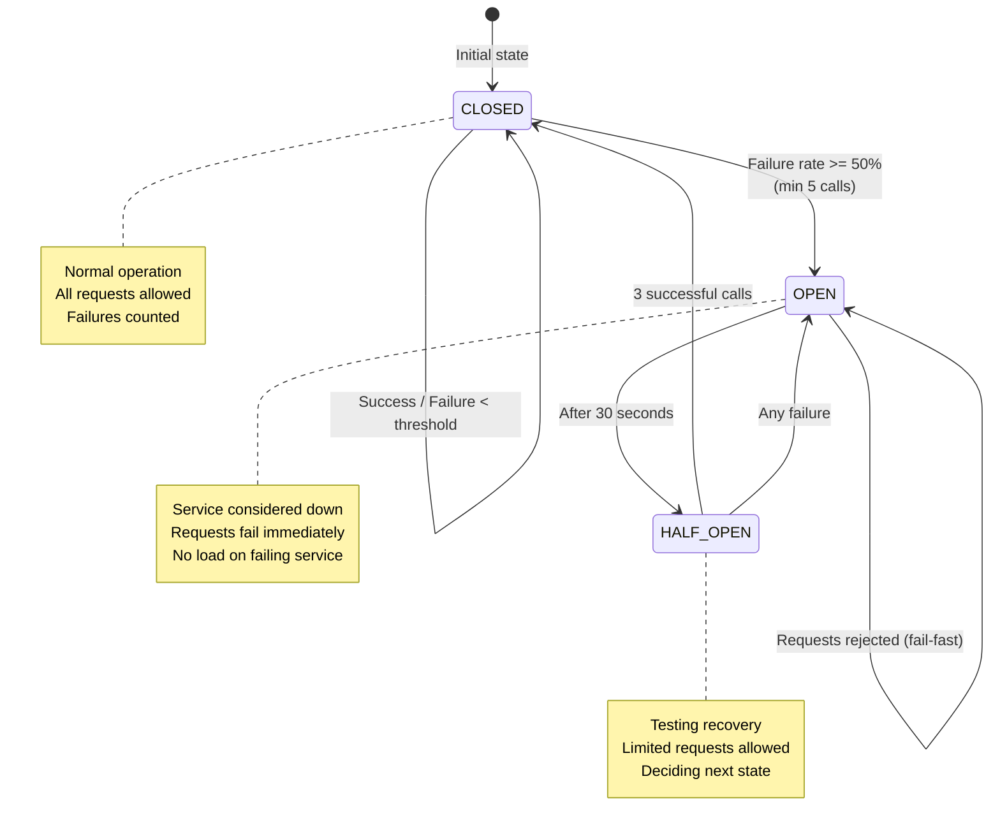

### 9.3 Mécanisme de Retry avec Backoff Exponentiel

```mermaid
sequenceDiagram
    participant Actor as RemoteActorRef
    participant Retry as Retry Policy
    participant CB as Circuit Breaker
    participant Service as Remote Service
    
    Actor->>Retry: Execute request
    
    Retry->>CB: Check state
    CB-->>Retry: CLOSED (allow)
    
    Retry->>Service: Attempt 1
    Service--xRetry: Timeout/Error
    
    Note over Retry: Wait 500ms (backoff)
    
    Retry->>Service: Attempt 2
    Service--xRetry: Timeout/Error
    
    Note over Retry: Wait 1000ms (backoff x2)
    
    Retry->>Service: Attempt 3
    Service-->>Retry: Success!
    
    Retry-->>Actor: Response
    
    Note over CB: All attempts counted<br/>for circuit breaker
```

### 9.4 Configuration Resilience4j

| Paramètre | Valeur | Description |
|-----------|--------|-------------|
| **Circuit Breaker** | | |
| minimumNumberOfCalls | 5 | Appels minimum avant évaluation |
| failureRateThreshold | 50% | Taux d'échec pour ouverture |
| waitDurationInOpenState | 30s | Durée en état OPEN |
| permittedCallsInHalfOpen | 3 | Appels permis en HALF_OPEN |
| slidingWindowSize | 10 | Taille de la fenêtre glissante |
| **Retry** | | |
| maxAttempts | 3 | Nombre maximum de tentatives |
| initialInterval | 500ms | Délai initial entre tentatives |
| multiplier | 2.0 | Multiplicateur backoff exponentiel |
| Séquence | 500ms → 1s → 2s | Délais entre les tentatives |

### 9.5 API de Monitoring Resilience

```mermaid
graph LR
    subgraph "Endpoints /resilience"
        E1[GET /circuit-breakers]
        E2[GET /circuit-breakers/{name}]
        E3[GET /health]
        E4[GET /remote-actors]
    end
    
    subgraph "Réponses"
        R1[Liste des CBs<br/>+ états + métriques]
        R2[Détails CB<br/>succès/échecs/taux]
        R3[HEALTHY / RECOVERING<br/>/ DEGRADED]
        R4[Acteurs distants<br/>+ état CB associé]
    end
    
    E1 --> R1
    E2 --> R2
    E3 --> R3
    E4 --> R4
```

---

## 10. Tests d'Intégration Inter-Services

### 10.1 Architecture de Test

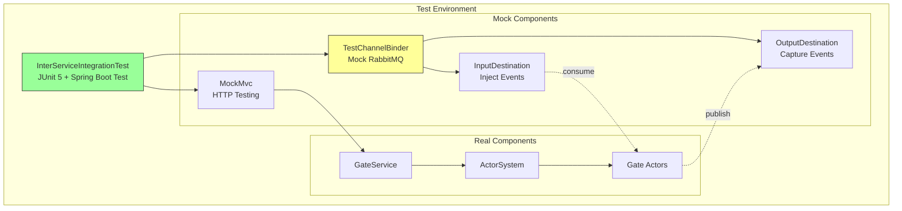

### 10.2 Couverture des Tests Inter-Services

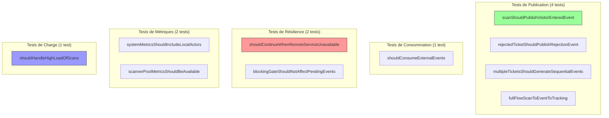

### 10.3 Flux de Test Complet

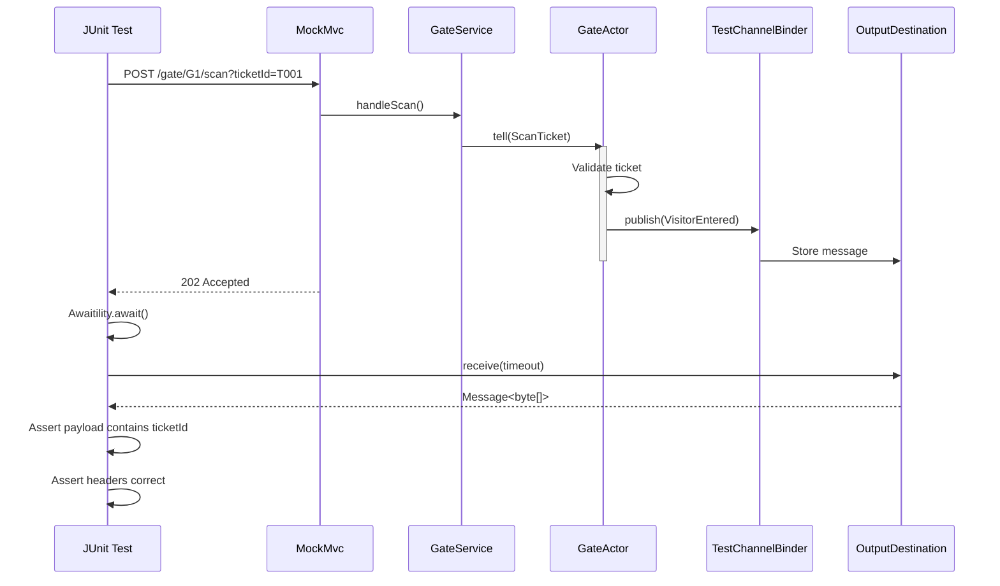

### 10.4 Bibliothèques de Test Utilisées

| Bibliothèque | Version | Usage |
|--------------|---------|-------|
| JUnit 5 | 5.10+ | Framework de tests |
| Spring Boot Test | 3.4+ | Contexte Spring pour tests |
| MockMvc | - | Tests endpoints REST |
| AssertJ | 3.24+ | Assertions fluides |
| Awaitility | 4.2.0 | Tests asynchrones avec attente conditionnelle |
| Spring Cloud Stream Test Binder | - | Simulation RabbitMQ sans broker réel |

### 10.5 Scénarios de Test Détaillés

```mermaid
flowchart TB
    subgraph "Scénario 1: Publication d'événements"
        S1A[Scan ticket] --> S1B[Vérifier 202 Accepted]
        S1B --> S1C[Attendre événement]
        S1C --> S1D[Valider payload]
        S1D --> S1E[Valider headers]
    end
    
    subgraph "Scénario 2: Résilience"
        S2A[Eureka désactivé] --> S2B[Scan ticket]
        S2B --> S2C[Vérifier succès local]
        S2C --> S2D[Événement publié malgré tout]
    end
    
    subgraph "Scénario 3: Charge"
        S3A[50 tickets] --> S3B[Scans parallèles]
        S3B --> S3C[Tous acceptés]
        S3C --> S3D[Mesurer performance]
        S3D --> S3E[Service opérationnel]
    end
    
    style S1A fill:#9f9,stroke:#333
    style S2A fill:#f99,stroke:#333
    style S3A fill:#99f,stroke:#333
```

---

## Utilisation des Diagrammes

Ces diagrammes peuvent être rendus avec:

1. **GitHub/GitLab**: Support natif de Mermaid dans les fichiers Markdown
2. **VS Code**: Extension "Mermaid Preview"
3. **Mermaid Live Editor**: https://mermaid.live/
4. **Confluence**: Plugin Mermaid
5. **Notion**: Support natif

Pour générer des images PNG/SVG:
```bash
npm install -g @mermaid-js/mermaid-cli
mmdc -i ARCHITECTURE.md -o architecture.png
```

---

## Résumé des Composants

| Composant | Description | Localisation |
|-----------|-------------|--------------|
| ActorSystem | Gestion des acteurs locaux et distants | `actor-framework/core/` |
| LocalActorRef | Référence vers acteur local + mailbox | `actor-framework/runtime/` |
| RemoteActorRef | Référence vers acteur distant + Resilience4j | `actor-framework/runtime/` |
| ResilienceConfig | Configuration Circuit Breaker + Retry | `actor-framework/resilience/` |
| ResilienceController | API monitoring résilience | `actor-framework/runtime/` |
| AutoScalingActorPool | Pool avec scaling automatique | `actor-framework/scalability/` |
| GateActor | Acteur porte d'entrée | `gate-service/domain/` |
| RideActor | Acteur attraction | `ride-service/domain/` |
| InterServiceIntegrationTest | Tests inter-services | `gate-service/src/test/` |
