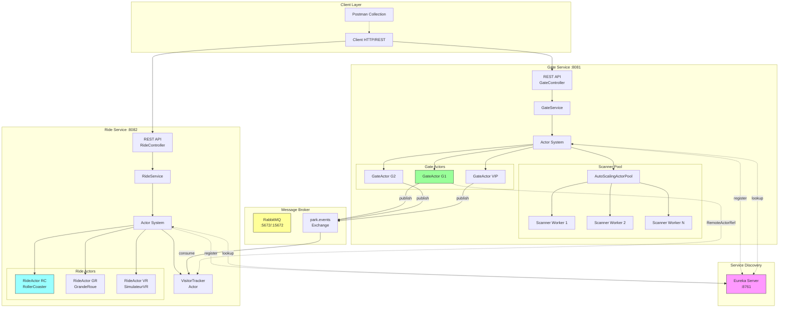
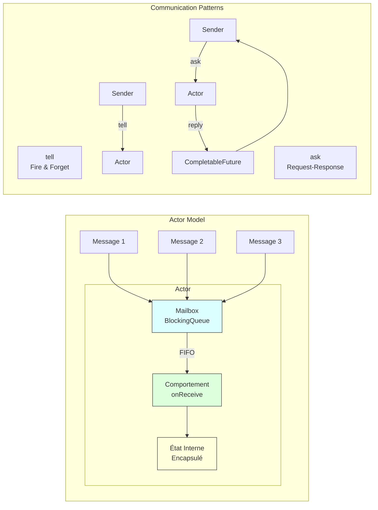
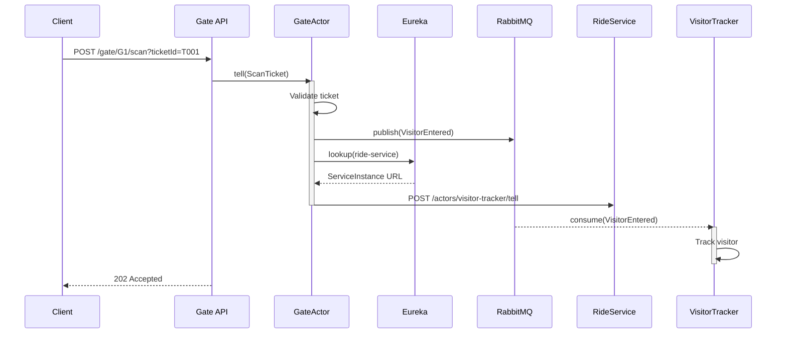
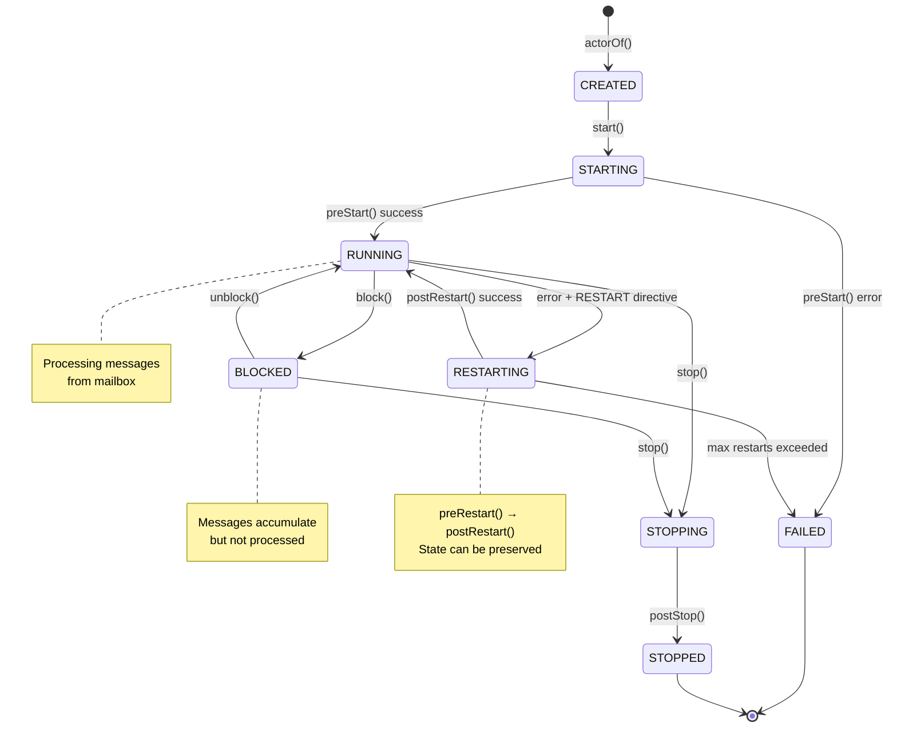
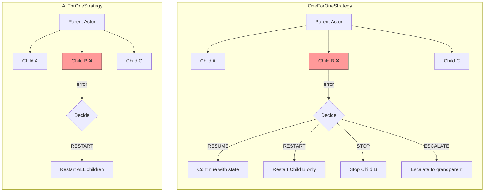
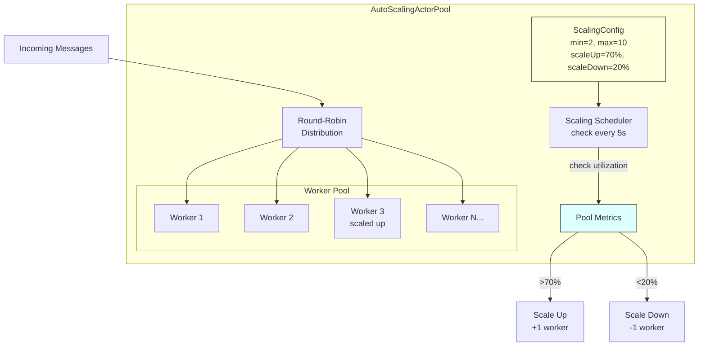
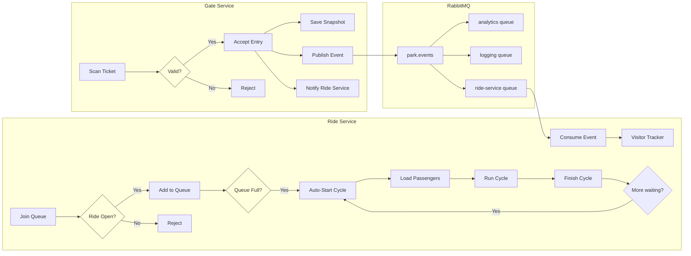
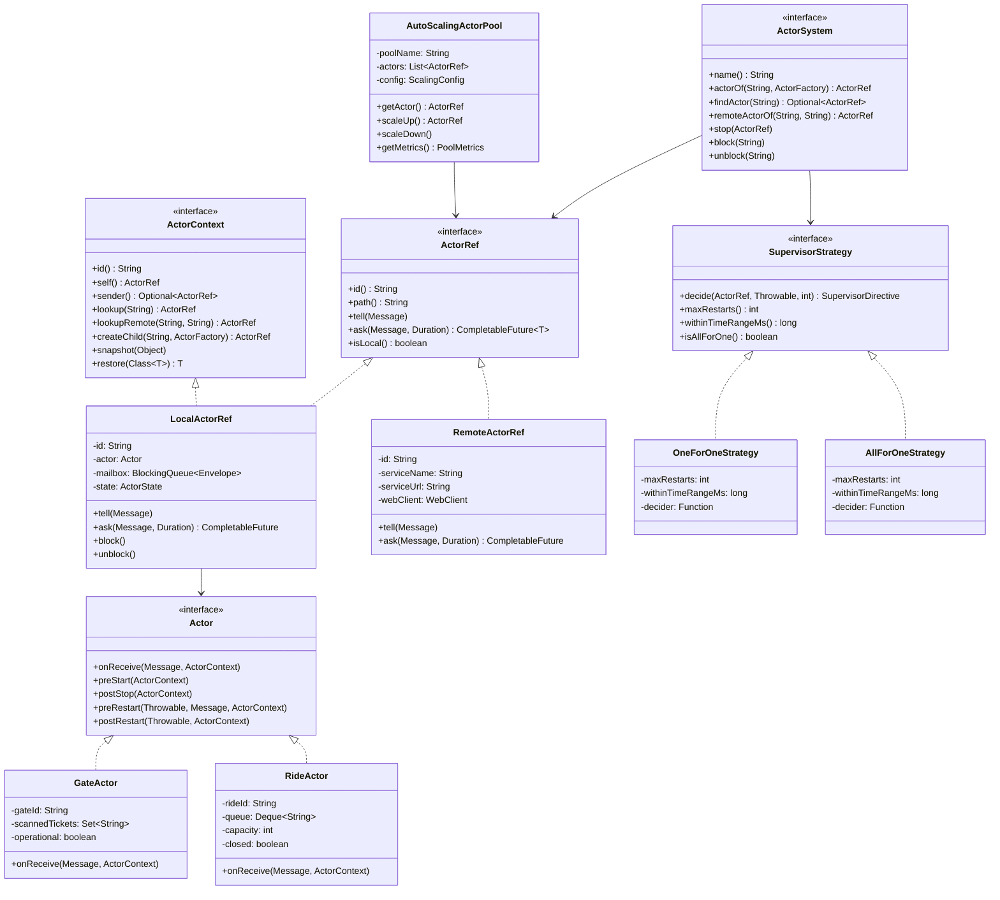

# Diagrammes d'Architecture - CY Land Actor Framework

Ce document contient les diagrammes d'architecture du projet CY Land, un framework d'acteurs distribués inspiré d'Akka.

## Table des matières

1. [Architecture Globale](#1-architecture-globale)
2. [Modèle d'Acteurs](#2-modèle-dacteurs)
3. [Communication Inter-Services](#3-communication-inter-services)
4. [Cycle de Vie des Acteurs](#4-cycle-de-vie-des-acteurs)
5. [Stratégies de Supervision](#5-stratégies-de-supervision)
6. [Auto-Scaling Pool](#6-auto-scaling-pool)
7. [Flux de Données](#7-flux-de-données)
8. [Diagramme de Classes](#8-diagramme-de-classes)

---

## 1. Architecture Globale



---

## 2. Modèle d'Acteurs



---

## 3. Communication Inter-Services



---

## 4. Cycle de Vie des Acteurs



---

## 5. Stratégies de Supervision



---

## 6. Auto-Scaling Pool



---

## 7. Flux de Données



---

## 8. Diagramme de Classes



---

## Utilisation des Diagrammes

Ces diagrammes peuvent être rendus avec:

1. **GitHub/GitLab**: Support natif de Mermaid dans les fichiers Markdown
2. **VS Code**: Extension "Mermaid Preview"
3. **Mermaid Live Editor**: https://mermaid.live/
4. **Confluence**: Plugin Mermaid
5. **Notion**: Support natif

Pour générer des images PNG/SVG:
```bash
npm install -g @mermaid-js/mermaid-cli
mmdc -i ARCHITECTURE.md -o architecture.png
```
